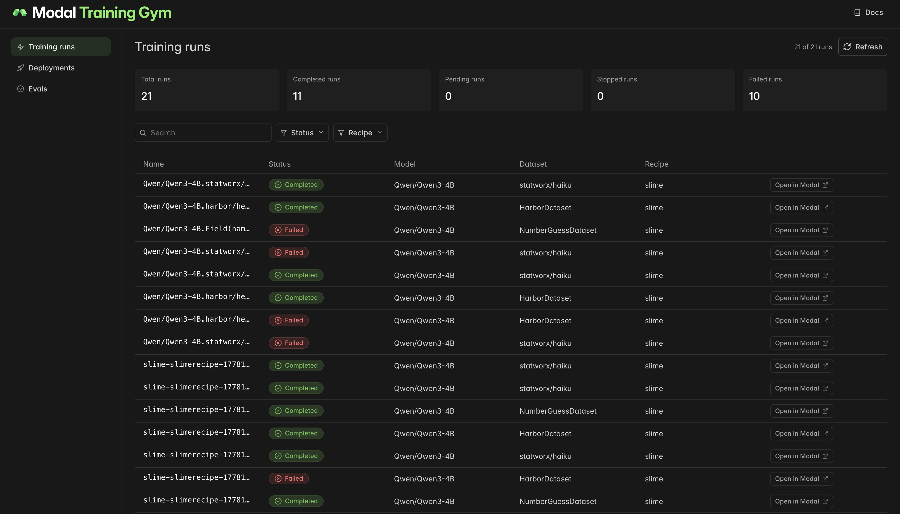

# Training Gym

**[📖 Documentation](https://gym.modal.dev)** · **[API Reference](https://gym.modal.dev/reference/)**

Modal Training Gym is a Python SDK for **RL post-training** on [Modal](https://modal.com)—so you don't have to hand-roll a launcher every time.

Pick a base model, a dataset, and an RL framework; the gym handles cluster topology, Ray/NCCL bring-up, volume mounts, checkpointing, and serving for eval and rollouts.

## Quickstart

Install with pip:

```bash
pip install -q git+https://github.com/modal-projects/training-gym.git@main
```

Or pin it in `pyproject.toml` for uv:

```toml
training-gym = { git = "https://github.com/modal-projects/training-gym.git", branch = "main" }
```

Then import the building blocks from your own script:

```python
from modal_training_gym import TrainConfig
```

> [!NOTE]
> **Python 3.12 is required.** Modal's `serialized=True` functions use
> cloudpickle, which requires the local Python version to exactly match the
> remote container's. All framework images ship Python 3.12, so running from
> 3.11 or 3.13 will fail at app build time.

## Agent set-up

This repository includes an `AGENTS.md` and a `skills/` directory (symlinked to `.claude/skills/`) that teach Claude Code how to navigate the framework — W&B configuration, custom rollouts and generate functions, custom eval functions, and more.

Clone the repo and run `claude` from its root; the skills load automatically based on what you ask for.

## Observability dashboard

Training Gym ships a dashboard that aggregates training runs, deployments,
and eval results in one place. Deploy your own copy:

```bash
training-gym setup
```

Modal prints a URL where you can watch jobs in progress.




## Tutorials

The fastest path through the API is the [tutorials](./tutorials/). Each one
ships as a runnable `.py` **and** a paired `.ipynb` narrated cell-by-cell —
the notebook is the canonical walkthrough. Each tutorial below has a one-click
**Launch** button that opens the `.ipynb` in a fresh Modal Notebook; the first
code cell pip-installs `modal-training-gym` into the notebook kernel, so the
rest of the cells run as-is.

**Difficulty** is a rough self-assessed signal for where to start:

- *Beginner* — single-node, introduces one framework concept.
- *Intermediate* — 1–2 nodes, or wires up something non-default (custom
  reward, external script).
- *Advanced* — ≥2 nodes with non-trivial parallelism (tensor-parallel,
  colocated RL, long context); assumes familiarity with the underlying
  framework.

<!-- BEGIN TUTORIAL TABLE -->
<!-- Auto-generated by generate_tutorial.py from TUTORIAL_METADATA in each tutorial source. Edit metadata there, not here. -->

### RL

| Tutorial | Summary | Difficulty | Framework | Launch |
|---|---|---|---|---|
| [`000_rl_basics`](tutorials/rl/000_rl_basics/000_rl_basics.ipynb) | Qwen3-4B haiku evaluation with verifiable rewards — serve, evaluate, train, compare | Beginner | `slime` | <a href="https://modal.com/notebooks/new/https://github.com/modal-projects/training-gym/blob/main/tutorials/rl/000_rl_basics/000_rl_basics.ipynb" target="_blank" rel="nofollow noopener noreferrer"></a> |
| [`001_sandboxes`](tutorials/rl/001_sandboxes/001_sandboxes.ipynb) | Code RL with Harbor hello-world and sandboxed verification | Intermediate | `slime` | <a href="https://modal.com/notebooks/new/https://github.com/modal-projects/training-gym/blob/main/tutorials/rl/001_sandboxes/001_sandboxes.ipynb" target="_blank" rel="nofollow noopener noreferrer"></a> |
| [`002_multiturn`](tutorials/rl/002_multiturn/002_multiturn.ipynb) | Multi-turn number-guessing RL with custom generate and reward functions | Intermediate | `slime` | <a href="https://modal.com/notebooks/new/https://github.com/modal-projects/training-gym/blob/main/tutorials/rl/002_multiturn/002_multiturn.ipynb" target="_blank" rel="nofollow noopener noreferrer"></a> |
| [`003_on_policy_distillation`](tutorials/rl/003_on_policy_distillation/003_on_policy_distillation.ipynb) | On-policy distillation on math — Qwen3-8B teacher, Qwen3-4B student | Intermediate | `slime` | <a href="https://modal.com/notebooks/new/https://github.com/modal-projects/training-gym/blob/main/tutorials/rl/003_on_policy_distillation/003_on_policy_distillation.ipynb" target="_blank" rel="nofollow noopener noreferrer"></a> |
| [`005_dapo`](tutorials/rl/005_dapo/005_dapo.ipynb) | DAPO on math with Qwen3-4B | Advanced | `slime` | <a href="https://modal.com/notebooks/new/https://github.com/modal-projects/training-gym/blob/main/tutorials/rl/005_dapo/005_dapo.ipynb" target="_blank" rel="nofollow noopener noreferrer"></a> |
| [`006_audio_asr`](tutorials/rl/006_audio_asr/006_audio_asr.ipynb) | Audio GRPO on Qwen3-ASR-1.7B — transcribe LibriSpeech, reward −WER | Intermediate | `slime` | <a href="https://modal.com/notebooks/new/https://github.com/modal-projects/training-gym/blob/main/tutorials/rl/006_audio_asr/006_audio_asr.ipynb" target="_blank" rel="nofollow noopener noreferrer"></a> |
| [`007_cross_tokenizer_distillation`](tutorials/rl/007_cross_tokenizer_distillation/007_cross_tokenizer_distillation.ipynb) | Cross-tokenizer agentic distillation on Toolathlon with live, environment-grounded rewards — DeepSeek V4 Flash teacher, Qwen3.6-35B-A3B student | Advanced | `slime` | <a href="https://modal.com/notebooks/new/https://github.com/modal-projects/training-gym/blob/main/tutorials/rl/007_cross_tokenizer_distillation/007_cross_tokenizer_distillation.ipynb" target="_blank" rel="nofollow noopener noreferrer"></a> |

### Single Node

| Tutorial | Summary | Difficulty | Framework | Launch |
|---|---|---|---|---|
| [`001_qwen27b`](tutorials/singlenode/001_qwen27b/001_qwen27b.ipynb) | Train Qwen3.6-27B on DAPO-math with GRPO | Advanced | `slime` | <a href="https://modal.com/notebooks/new/https://github.com/modal-projects/training-gym/blob/main/tutorials/singlenode/001_qwen27b/001_qwen27b.ipynb" target="_blank" rel="nofollow noopener noreferrer"></a> |
| [`000_qwen35b`](tutorials/singlenode/000_qwen35b/000_qwen35b.ipynb) | Train Qwen3.6-35B-A3B on DAPO-math with GRPO | Advanced | `slime` | <a href="https://modal.com/notebooks/new/https://github.com/modal-projects/training-gym/blob/main/tutorials/singlenode/000_qwen35b/000_qwen35b.ipynb" target="_blank" rel="nofollow noopener noreferrer"></a> |

### Agents

| Tutorial | Summary | Difficulty | Framework | Launch |
|---|---|---|---|---|
| [`000_agent_sandbox`](tutorials/agent/000_agent_sandbox/000_agent_sandbox.ipynb) | Build an LLM agent harness with a self-hosted model and Modal Sandbox tool execution | Beginner | Modal Sandbox | <a href="https://modal.com/notebooks/new/https://github.com/modal-projects/training-gym/blob/main/tutorials/agent/000_agent_sandbox/000_agent_sandbox.ipynb" target="_blank" rel="nofollow noopener noreferrer"></a> |

### Multinode

| Tutorial | Summary | Difficulty | Framework | Launch |
|---|---|---|---|---|
| [`000_kimi_k25`](tutorials/multinode/000_kimi_k25/000_kimi_k25.ipynb) | Kimi K2.5 LoRA GRPO training on 128 GPUs with DAPO-Math-17k | Advanced | `miles` | <a href="https://modal.com/notebooks/new/https://github.com/modal-projects/training-gym/blob/main/tutorials/multinode/000_kimi_k25/000_kimi_k25.ipynb" target="_blank" rel="nofollow noopener noreferrer"></a> |
| [`001_kimi_k26`](tutorials/multinode/001_kimi_k26/001_kimi_k26.ipynb) | Kimi K2.6 LoRA GRPO training on 128 GPUs with DAPO-Math-17k | Advanced | `miles` | <a href="https://modal.com/notebooks/new/https://github.com/modal-projects/training-gym/blob/main/tutorials/multinode/001_kimi_k26/001_kimi_k26.ipynb" target="_blank" rel="nofollow noopener noreferrer"></a> |
| [`002_glm_4_7`](tutorials/multinode/002_glm_4_7/002_glm_4_7.ipynb) | GLM-4.7 355B MoE full-weight GSPO training on 64 GPUs with DAPO-Math-17k | Advanced | `slime` | <a href="https://modal.com/notebooks/new/https://github.com/modal-projects/training-gym/blob/main/tutorials/multinode/002_glm_4_7/002_glm_4_7.ipynb" target="_blank" rel="nofollow noopener noreferrer"></a> |
<!-- END TUTORIAL TABLE -->

See [`tutorials/README.md`](tutorials/README.md) for how to run the `.py`
companions from the CLI and how to author a new tutorial.

## Multi-node access

> [!IMPORTANT]
> Single-node training is open to everyone. Multi-node clusters — required
> for larger models — are still in Beta.
> [**Contact us on Slack**](https://modal.com/slack) for access.

## Architecture


## Documentation

Full docs are hosted at **[gym.modal.dev](https://gym.modal.dev)**:

- [API Reference](https://gym.modal.dev/reference/) — every public class documented with types and defaults

Modal platform references:

- [Using CUDA on Modal](https://modal.com/docs/guide/cuda)
- [GPU Metrics](https://modal.com/docs/guide/gpu-metrics)
- [Multi-node clusters (Beta)](https://modal.com/docs/guide/multi-node-training)
- [Multi-GPU training on Modal](https://modal.com/docs/guide/gpu#multi-gpu-training)

## License

[MIT](LICENSE).
